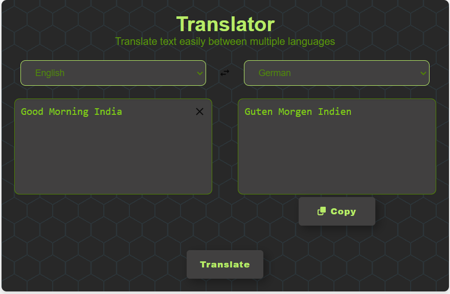

# Translator App

A simple web application that translates text from one language to another using the Microsoft Translator Text API. The app allows users to select input and output languages, type or paste text to be translated, and copy the translated text to the clipboard. It also provides visual feedback during the translation process.

## Features

- Select input and output languages from dropdown lists.
- Translate text from one language to another.
- Copy translated text to the clipboard.
- Visual feedback during the translation process with loading indicators.
- Clear input and output text fields.
- Swap input and output languages.

## Technologies Used

- React
- JavaScript (ES6+)
- CSS
- Microsoft Translator Text API
- Netlify for deployment

## Deployment

The app is deployed using Netlify. You can view the live application at [Link Translator-APP](https://translate-by-mrugank.netlify.app/)
